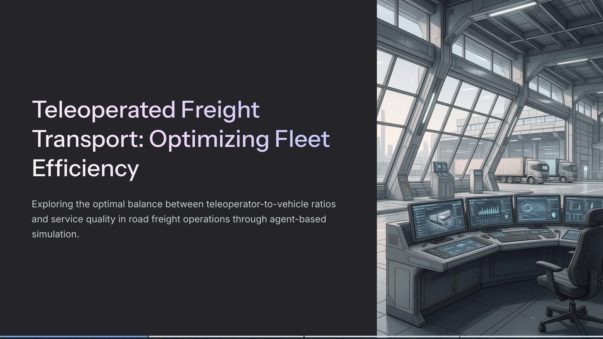
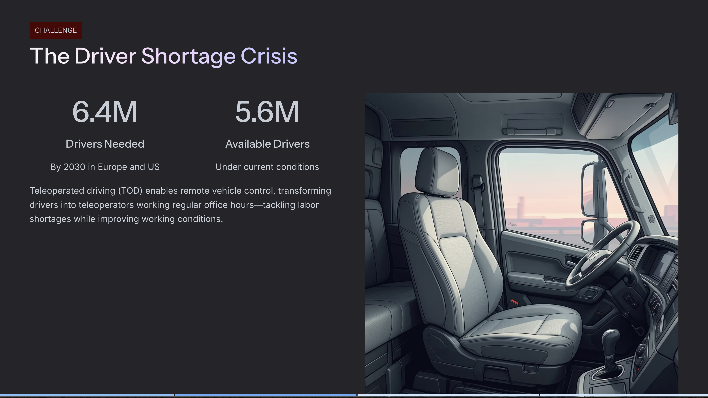
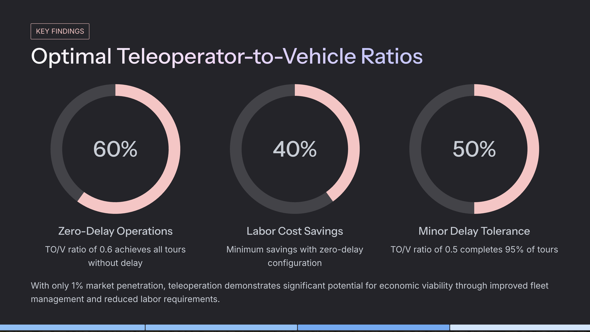
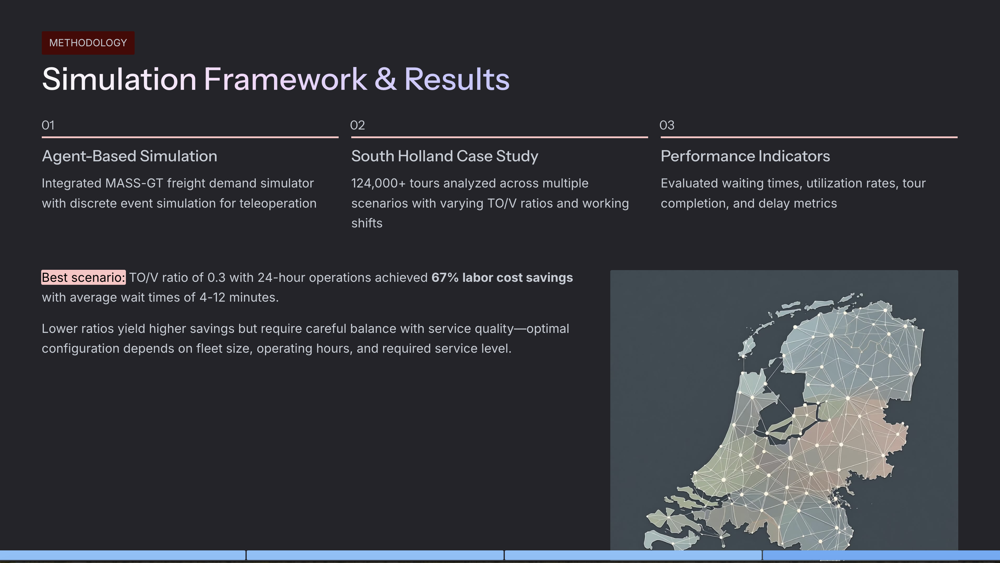

Teleoperated driving (TOD) enables humans to operate vehicles remotely during challenging scenarios, offering a promising transition path toward full automation in freight transport. This study addresses the growing truck driver shortage crisis—with Europe and the US projected to need 6.4 million drivers by 2030 but only 5.6 million available—by exploring how teleoperation can transform drivers into teleoperators working regular office hours.

We developed the **first simulation framework for teleoperated fleet management** in road freight transport, integrating discrete event simulation with the MASS-GT multi-agent freight demand model. The framework enables systematic exploration of the critical trade-off between teleoperator-to-vehicle (TO/V) ratios and service quality.

## Key Findings

Through analysis of **360 simulation scenarios** using freight tour data from the South Holland region (124,000+ daily tours), we demonstrate that:

- A **TO/V ratio of 0.6** achieves zero-delay operations, implying **40% labor cost savings**
- With minor delays (4-12 min average wait), **TO/V ratios as low as 0.5** are feasible, yielding **up to 60% savings**
- 24-hour teleoperation centers can achieve **67% labor cost reduction** with TO/V ratio of 0.3

These findings confirm significant potential for a positive business case for teleoperated driving as a service, with open-source simulation tools provided to support future research and industry application.

## Visual Summary

